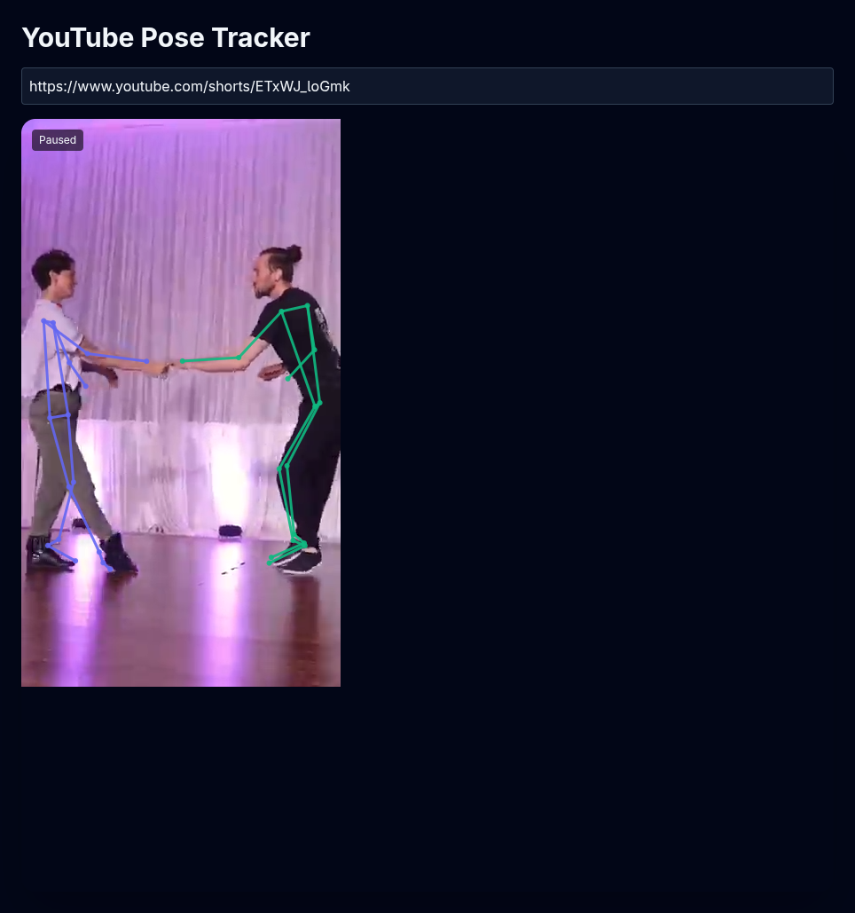

# YouTube Pose Tracker

### Preview



### Prereqs

- Node 18+

### Dev (two processes via workspaces)

```bash
npm install
npm run dev
```

- Client: http://localhost:5173
- Server: http://localhost:3000

## Build & Run (serve built client from server)

```bash
# build both
npm run build
# start server (serves API and client)
npm start
```
